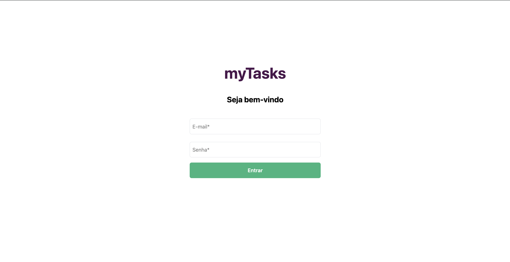
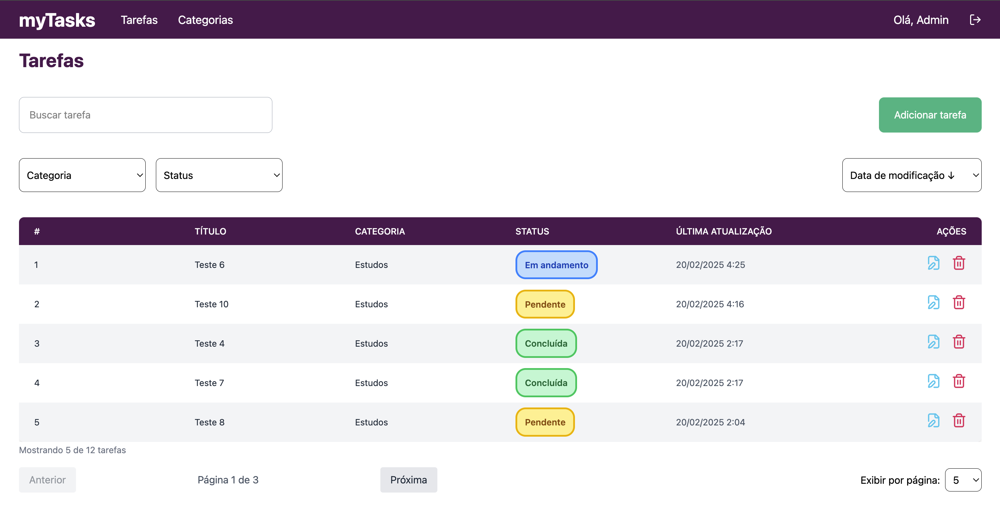
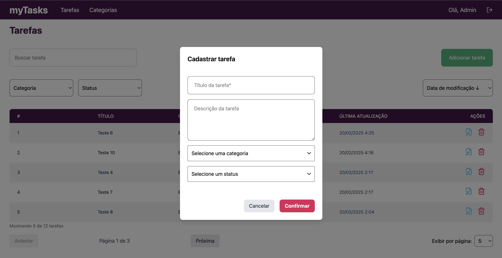
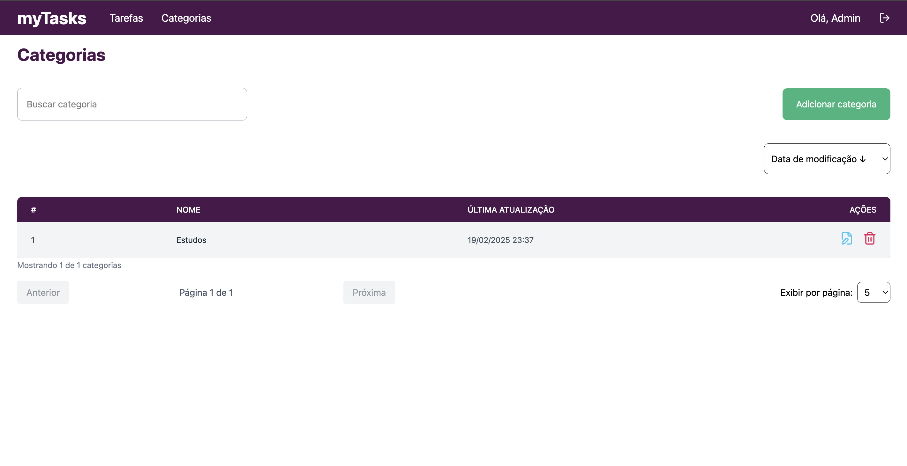
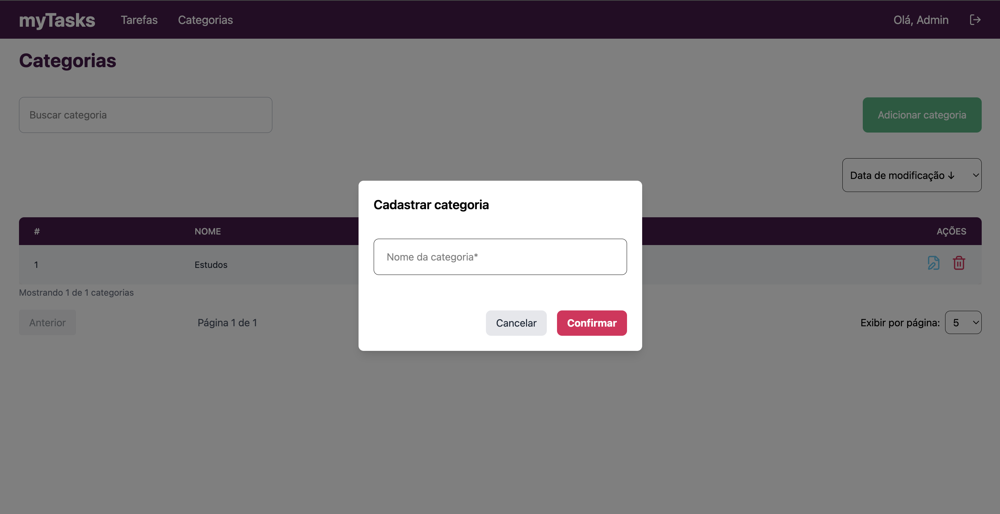

# Introdução

myTasks Web - Aplicação frontend para cadastro de tarefas.

# Sobre o build

O app foi criado com a utilização das seguintes ferramentas:

Para o frontend:
- React;
- React-Router-Dom;
- Typescript;
- Axios;
- React-Query

# Instalação

`yarn`

ou

`npm install`

# Execução

`yarn dev`

ou

`npm run dev`

A aplicação estará disponível no endereço http://localhost:5173

# Screenshots

